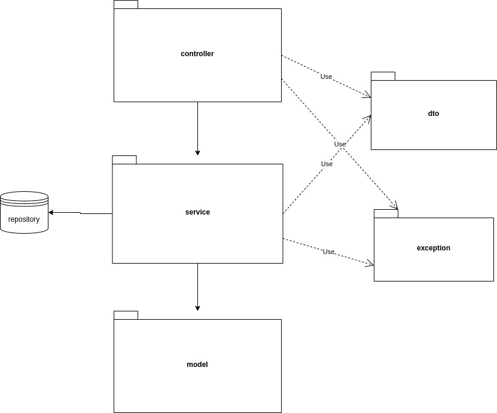

# Operación Fuego de Quasar

Este repositorio contiene la implementación de un API Rest que proporciona diferentes servicios para recuperar o enviar información y obtener datos de la nave de carga o modificar los datos de un satélite.

La aplicación está desarrollada utilizando un patrón de diseño muy similar a MVC. En este caso, los controladores se comunican con los servicios, y estos a su vez se comunican con los modelos para completar las solicitudes.

# Arquitectura de la Aplicación
La aplicación sigue una arquitectura modular que separa las responsabilidades en diferentes modulos. Cada modulo tiene un propósito específico y se comunica con otros modulos de acuerdo con las reglas definidas.




- **Controller**: Contiene las clases que manejan las solicitudes HTTP entrantes y envían las respuestas correspondientes.
  
- **Model**: Define la estructura de los datos de la aplicación.
  
- **Service**: Contiene la lógica de negocio de la aplicación.
  
- **DTO (Data Transfer Object)**: Objetos utilizados para transferir datos entre diferentes capas de la aplicación.
  
- **Repository**: Se encarga de interactuar con la capa de persistencia de datos.
  
- **Exception**: Contiene clases para manejar errores específicos de la aplicación.


## Documentación de la API

La documentación de la API, que incluye los diferentes endpoints disponibles, se puede encontrar en el siguiente enlace: [Documentación de la API](https://operation-quasar-fire.onrender.com/api/swagger-ui/index.html).

## Endpoints Disponibles

Esta API se encuentra desplegada en un repositorio en la nube, y las consultas a los distintos servicios proporcionados por esta son accesibles a través de las siguientes URLs:

- [GET] [https://operation-quasar-fire.onrender.com/topsecret](https://operation-quasar-fire.onrender.com/topsecret)
- [GET] [https://operation-quasar-fire.onrender.com/topsecret_split](https://operation-quasar-fire.onrender.com/topsecret_split)
- [POST] [https://operation-quasar-fire.onrender.com/topsecret_split/{sateliteName}](https://operation-quasar-fire.onrender.com/topsecret_split/{sateliteName})

## Ejecución Local

Para ejecutar la aplicación localmente, utilizando el siguiente comando para compilar y empaquetar tu aplicación en un archivo JAR ejecutable

```shell
./gradlew build
```

El archivo generado suele almacenarse dentro de la carpeta build/libs/. Este JAR te permite ejecutar la aplicación en otro lugar, como en un servidor o en otro entorno, sin necesidad de Gradle instalado.

Otra opcion es utilizar el siguiente comando para iniciar la aplicacion en un servidor local:

```shell
./gradlew bootRun
```
La aplicación se desplegará en el puerto `8009` y será accesible a través de la siguiente URL: [http://localhost:8009](http://localhost:8009).
